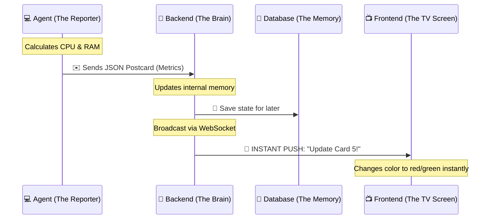
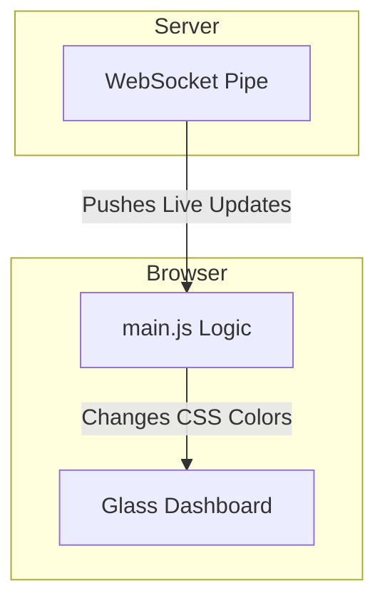

# 🧙‍♂️ Welcome to Merlin: The Magic of Real-Time Monitoring!

Hello! Welcome to the **Merlin Architecture Guide**. 

If you are new to programming, servers, or networking, don't worry! We are going to learn how Merlin works by breaking it down step-by-step. 

Think of Merlin as a **Global Weather Tracking System**, but instead of tracking rain and sunshine, we are tracking the "health" (CPU, RAM, Storage) of computers all over the world.

---

## 🗺️ The Big Picture

Before we dive into the code, let's look at the flow of information. Merlin relies on a **Push-Based Architecture**. 

*Instead of the dashboard constantly asking the computers "Are you okay?", the computers yell out "I'm okay!" every 2 seconds.*

Here is how the data flows:

---

## 💻 1. The Agent (The Field Reporter)
**File Location:** `/agent/merlin_agent.sh`

Imagine you have reporters standing in different cities, taking notes on the weather, and mailing postcards to the news station. That is our **Agent**.

* **What is it?** A tiny, simple Bash script (`.sh` file).
* **How it works:** It sits on a remote computer and runs in an infinite loop (it sleeps for 2 seconds, wakes up, checks the computer's health, and goes back to sleep).
* **The Magic:** It uses built-in Linux tools (like `free` for RAM, and `df` for Hard Drive space). It packages these numbers into a neat digital box called a **JSON Payload**, and uses a tool called `curl` to throw that box across the internet to our Backend.

---

## 🧠 2. The Backend (The Brain & The News Station)
**File Location:** `/backend/main.py`

This is the control center. Written in **Python** using a super-fast framework called **FastAPI**. 

The Backend has three main jobs:
1. **The Receiver (REST API):** It has an open door (`/api/metrics`) waiting for the Agents' postcards. When an Agent throws a box of data at this door, the Backend catches it.
2. **The Memory Keeper:** As soon as it catches the data, it scribbles down the information in a notepad (the computer's RAM) so it can look it up lightning-fast later. It also files a copy away in the Database.
3. **The Broadcaster (WebSockets):** This is the coolest part. Instead of waiting for the Frontend (the TV) to ask for the news, the Backend maintains a live, open pipe (a WebSocket) to the TV. The *millisecond* it receives a postcard from an Agent, it shoves that data down the pipe to the TV screen.

### 🚨 The Watchdog (Heartbeat Monitor)
What happens if a computer dies and stops sending postcards? 
The Backend has a background task called a `watchdog_task`. Every 5 seconds, it checks the clock. If it notices that an Agent hasn't sent a postcard in over 30 seconds, it declares that machine `"unreachable"` and broadcasts a red alert to the TV.

---

## 📺 3. The Frontend (The Live TV Screen)
**File Location:** `/frontend/main.js` & `/frontend/style.css`

This is what you see in your web browser. 

* **No Refreshing Allowed!** In the old days of the internet, you had to refresh the page to see new data. Not here. The frontend uses a **WebSocket** to listen to the Backend's live broadcast.
* **Reactivity:** When the Backend yells, *"Agent 123's CPU is now at 99%!"*, the Javascript file (`main.js`) instantly finds the specific card on your screen and changes the progress bar to red. 
* **Styling (`style.css`):** This file makes things look pretty, using "Glassmorphism" (making backgrounds look like frosted glass) and animations to make the data feel alive.

---

## 💾 4. The Database (The Filing Cabinet)
**Technology:** MongoDB

If the Backend's fast memory (RAM) is a notepad, MongoDB is a giant metal filing cabinet. 

If our Backend server ever crashes or needs to be restarted, its notepad is erased! But because we saved a copy of everything (Machine IDs, User Tags, IP addresses) in the MongoDB filing cabinet, the Backend can instantly read the files when it boots back up and restore the dashboard exactly as it was.

---

## 🛡️ 5. The VPN (The Secret Tunnel)
**File Location:** `/vpn/`

You might be wondering: *If the Backend's door is wide open on the internet, can't anyone throw a fake postcard at it?*

Yes! That's why we added the VPN layer.
Think of the VPN as an invisible, secret tunnel. By putting our Backend *inside* this tunnel, it becomes completely invisible to the public internet. Only Agents who have the secret map (VPN credentials) can even see the Backend's door, keeping hackers out entirely!

---

## 🎓 Summary Lesson

To recap, here is the life of a piece of data in Merlin:

1. **(Agent)** A remote computer checks its RAM and sees it's at 50%. It puts `{"ram": 50}` in an envelope.
2. **(Agent -> Backend)** It mails the envelope securely through the **Secret Tunnel (VPN)** to the **Backend (Python)**.
3. **(Backend)** The Backend opens the envelope, writes `50%` in its notepad, and saves a copy in the **Filing Cabinet (MongoDB)**.
4. **(Backend -> Frontend)** The Backend immediately turns around and yells `50%` down the **Live Pipe (WebSocket)**.
5. **(Frontend)** Your browser hears `50%`, finds the progress bar on your screen, and stretches it to exactly half-way, painting it green. 

All of this happens in less than a single second!
